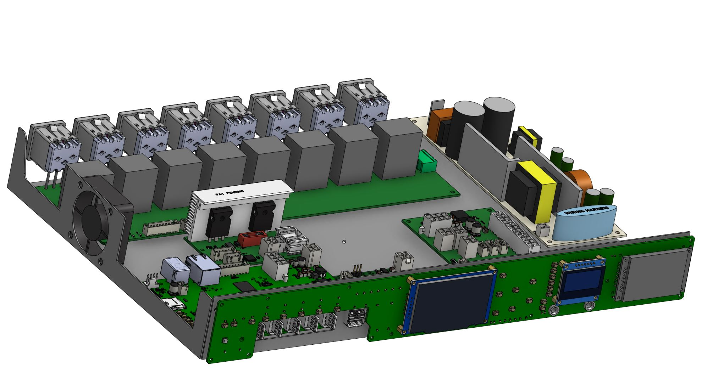
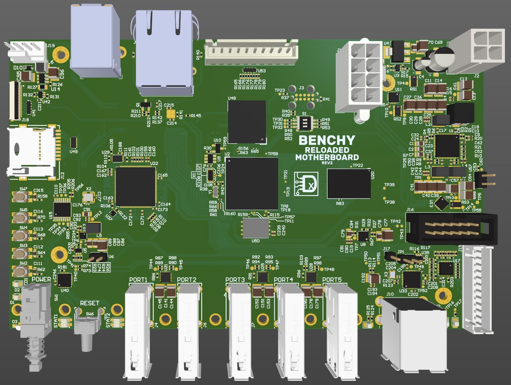

# BENCHY Version 2 - A Whole New Benchy Boi

>Alot of this is old and needs to be updated!

Your electronics workbench buddy! (Warning - Benchy is not actually your buddy and will probably try to kill you. It's hideously expensive, and way too time consuming to build!)

## Features

- Single Board Computer running embedded linux
- 5 Port USB 3.1 hub
- All data ports are **properly** protected agains over-current and backfeeding
- 2 USB 2.0 ports for the SBC peripherals (keyboard/mouse)
- 2 1Gb Ethernet ports
- 8 Software controlled relays for general things like lighting
- (In Development) Lab Power Supply W/ Current or Voltage Limiting (15V @ 2A)
- Lighting system that can drive 4 RGBW, 2 RGB, 6 dimmable, and 4 switched LED strips
- Electronic Load (5A Max)
- Simple 8 channel volt meter for quick and easy voltage testing
- (in development) Simple LCR Meter
- (in development) Function Generator

# Complete Assembly

## Motherboard Processor

This design integrates an STM32MP1 Series micro processor (U2) with 8Gb DDR3 memory (U20). This adds a large amount of raw power internally. Taking alot of the load required to control the sub-systems from the users PC and adds more flexability to the system as a whole.

## USB Hub

The main reason why I needed to design my own USB hub instead of stuffing an "off the shelf" hub up benchys trumpet was the absolute lack of protection circuitry in most "consumer grade" USB hubs. There is no back-feed protection, verry little to no current monitoring, and the bare minimum ESD and EMI protection. Thats just not acceptable! imagine my supprise when I cracked open an $85 hub from Amazon and, after blowing out a channel, found no power management at all. The cost of finding a hub that has these protections is going to be around the same price as designing and building my own. (Except for the time investment... but who cares about that?!?)

These features arent exaclty flashy, they dont look very good on a brochure. So they usually arent there. If they are, its just a bullet point. Often they just _claim_ to conform to the USB spec. The lack protection doesn't actually conform to the spec at all. I will admit, some of the protection features are optional and not necessary for every day use. The problem is an electronics workbench is very mean. It will bully these simple hubs until they don't want to play along anymore.

## I2C Bus

Im using a quite extensive I2C bus system to communicate with the different boards and functional blocks. This cuts WAY down on the number of wires and pins required for the main controller and allows for better modularity within benchy.

Due to the size of the bus and the different devices, the bus is split by an I2C Mux to keep bus integrity while communicating to far PCBs.

# Power Supply

The one thing that made the two different power supplies possible was the Switch-Mode Power Supply (SMPS) that was built into the DVR box that spawned this project. The output from the SMPS is a high-current 12V source and 30V source. This was easy to adapt to my needs.

## Adjustable supply

- 15v @ 2A
- Controlled from the motherboard or front panel

The adjustable supply is built with help from [Dave, (Thanks Dave!)](https://www.youtube.com/watch?v=CIGjActDeoM&list=PLBF35875F73B5C9B5&index=1&ab_channel=EEVblog) using the [LM317](https://rocelec.widen.net/view/pdf/mlzstqhekh/slvs044x.pdf?t.download=true&u=5oefqw) adjustable regulator.

## 5V Supply

The ATX supply can provide 15 amps to the USB ports allowing each port to supply around 2 amps. Power is managed by the [UCS2114s.](https://ww1.microchip.com/downloads/aemDocuments/documents/APID/ProductDocuments/DataSheets/UCS2114-Data-Sheet-20005743B.pdf) Controlling both the current limit and backfeeding.

# Electronic Load

Fairly standard design using a MOSFET in its linear region, dissipating alot of energy. With the help of a big heatsink and a fan, it can be used to load power supplies to test their response. The current shunt will allow for precise measurement of power usage. Control is linked to the main microcontroller on the the motherboard. Allowing full control.

# 8 Channel Volt Meter

Low voltage volt meters with moderate accuracy and speed. Designed to measure multiple voltage levels simultaneously. This is helpful for testing power supplies designed for advanced ICs that require lots of voltages to run. Such as Processors, FPGAs, and PC Motherboards.

# Function generator

Creates sine, square, and triangle waves. from ~100Hz to ~100KHz.

# 8 Mains Rated Relays

8 channel relay block used to control general things around the bench like lighting and other small devices. Rated for mains voltage but not for high current.
